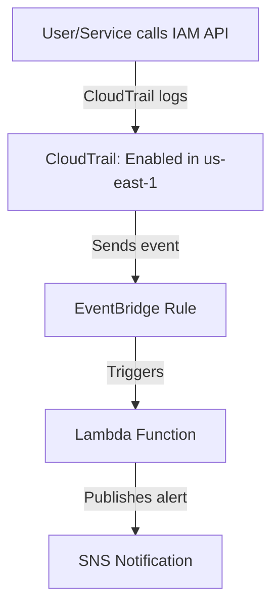

# IAM Sentinel 🔐
[](https://www.python.org/) 
[](https://opensource.org/licenses/MIT)

Real-time security monitoring system for AWS Identity and Access Management (IAM) critical operations.

## 📖 Table of Contents
- [IAM Sentinel 🔐](#iam-sentinel-)
  - [📖 Table of Contents](#-table-of-contents)
  - [🌟 Overview](#-overview)
  - [🚀 Key Features](#-key-features)
  - [🛡️ Supported Events](#️-supported-events)
  - [📦 Installation](#-installation)
  - [🔧 Configuration](#-configuration)
  - [🖥️ Usage](#️-usage)
  - [🤝 Contributing](#-contributing)
  - [📄 License](#-license)

## 🌟 Overview
IAM Sentinel is a serverless security solution that monitors critical AWS IAM operations in real-time, triggering alerts for potential security risks through Amazon SNS. It analyzes CloudTrail logs to detect high-risk actions like privilege escalation, unauthorized access, and credential manipulation.

**Why Use This?**
- Real-time detection of sensitive IAM operations
- Proactive security posture management
- Compliance with AWS security best practices
- Customizable alerting for critical events
- Automated deployment with an interactive setup script

## 🚀 Key Features
- **Real-time Alerts**: Instant notifications via SNS
- **Event Context**: Detailed descriptions of security implications
- **Severity Levels**: Critical/High/Medium risk classification
- **Security Recommendations**: Actionable mitigation steps
- **Multi-Resource Monitoring**: Users, Roles, Groups, Policies
- **Interactive Setup**: Automated provisioning via Python script
- **CloudShell Support**: Easy deployment via AWS CloudShell

## 🛡️ Supported Events
| Event Name                   | Type        | Description                                  | Severity  |
|------------------------------|-------------|----------------------------------------------|-----------|
| `CreateUser`                 | User        | New IAM user creation                        | High      |
| `DeleteUser`                 | User        | IAM user deletion                            | Critical  |
| `UpdateAssumeRolePolicy`     | Role        | Modification of role trust policy            | Critical  |
| `AttachUserPolicy`           | Policy      | Managed policy attachment to user            | High      |
| `DeactivateMFADevice`        | Security    | Disabling of MFA device                      | Critical  |
| `CreateAccessKey`            | Credential  | New access key generation                    | High      |
| `PutRolePolicy`              | Role        | Inline policy modification for roles         | High      |
| `DeleteRole`                 | Role        | IAM role deletion                            | Critical  |
| [View Full Event List](SUPPORTED_EVENTS.md) | | | |

## 📦 Installation
1. **Clone Repository**
```bash
git clone https://github.com/Paresh-Maheshwari/iam-sentinel.git
cd iam-sentinel
```

2. **Install Dependencies**
```bash
pip install -r requirements.txt
```

3. **Run Interactive Setup Script**
```bash
# Using local terminal
python3 setup.py

# Using AWS CloudShell for direct deployment
aws cloudshell start-session --command "python3 setup.py"
```
Follow the on-screen prompts to configure IAM roles, SNS, Lambda, and EventBridge.

4. **Confirm SNS Subscription**
Check your email and confirm the SNS subscription to start receiving alerts.

## 🔧 Configuration
1. **Environment Variables**
```env
SNS_TOPIC_ARN=arn:aws:sns:region:account-id:topic-name
```

2. **EventBridge Rule**
```json
{
  "source": ["aws.iam"],
  "detail-type": ["AWS API Call via CloudTrail"],
  "detail": {
    "eventSource": ["iam.amazonaws.com"],
    "eventName": ["CreateUser","DeleteUser","UpdateAssumeRolePolicy",...]
  }
}
```

3. **SNS Subscriptions**
- Configure email/SMS/Slack notifications for the SNS topic

## 🖥️ Usage
**Alert Workflow Diagram**



**Sample Alert**
```
🚨 IAM EVENT ALERT 🚨
========================================
⏰ Event Time: 2025-02-23T15:32:45Z
🌍 Region: us-east-1
🆔 Event ID: 1234-5678-9012
========================================

🔹 EVENT DETAILS
   🔧 Event Name: UpdateAssumeRolePolicy
   📖 Description: Role trust policy modified. High risk of cross-account abuse!
   🚩 Severity: CRITICAL
   📡 Event Source: iam.amazonaws.com

🔹 USER DETAILS
   👤 User Name: admin-user
   🆔 User ARN: arn:aws:iam::123456789012:user/admin-user
   🔐 MFA Enabled: false

⚠️ Recommended Action:
- Immediately review trust policy changes
- Verify cross-account permissions
- Revert if unauthorized
```

## 🤝 Contributing
1. Fork the repository
2. Create a feature branch (`git checkout -b feature/improvement`)
3. Commit changes (`git commit -am 'Add new feature'`)
4. Push to branch (`git push origin feature/improvement`)
5. Open a Pull Request

## 📄 License
This project is licensed under the MIT License - see [LICENSE](LICENSE) file for details.

---
**Maintained by**: *Paresh Maheshwari*

*\"Stay Secure in the Cloud!\"* ☁️🔒
